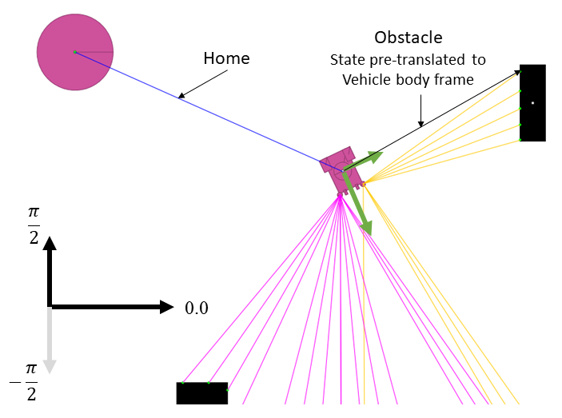

##### Requirements
- Java 1.8.x
- Maven

###### Packages
- [dyn4j-4.2.0](https://dyn4j.org/)
- [json-simple-4.0.1](https://cliftonlabs.github.io/json-simple/)

###### Networking
- [Apache ActiveMQ 6.1 (classic)](https://activemq.apache.org/)

##### User Input

\<Space> pause/resume \
Mouse click and drag moves the camera\
<1, 2, 3, 4, 5> select object to move - must include binding in World json\
<W, A, S, D> apply up, left, down, right force to the bound object\
\<X> zero out the force\

##### World
```json
{
  "pixels_per_meter": 20, # Required Camera scaling critical for position
  "vehicles": [           # Required Array
    {
      "name": "Sample.Callie",  # To load a class need full package name
      "position": [-5,-5],      # optional, default to random
      "draw_scan_lines": "true" # optional, default to false
      "home": [5,5]             # optional, default to N/A
    },{
      "name": "Marie",          # To load JSON this is filename in data folder
      "position": [5,5],
      "draw_scan_lines": "true"
    }
  ],
  "lights": [                # Optional Array
    {
      "position": [18,15],   # Location (required)
      "bound_key": 1         # Optional, default to unbound
    }, {
      "position": [-18.0, -15.0]
    }
  ],
  "obstacles": [             # Optional Array
    {
      "position": [-10,-10], # Obstacle's center (required)
      "size": [2,4]          # Width & Height (required)
      "bound_key": 2         # Optional, default to unbound
    }
  ],
  "food": [                 # Optional Array
    "timer": 200,           # Number of steps between food respawns
    "locations": [          # Required
      {
        "position": [-2,2],   # Required Center point of food spawn point
        "distribution": [3,3] # Required size of food spawn point +/- around position
      }
    ]
  ]
}
```
###### Details

Windows size is hard coded to 1600x800. The World is restricted to the Window size.

Camera has a pixels per meter (_ppm_) scale factor.

Therefore, object locations are restricted into the range:

[{-1600/_ppm_..1600/_ppm_},{-800/_ppm_..800/_ppm_}]

Key binding for light and obstacle moving is limited to 1 through 5.

##### Vehicles
```json
{
	"vehicleName": "Marie",       # Required
	"color": [188, 236, 51],      # Optional, default CYAN
    "state": "Sample.MyState",    # Optional, read compile time notes in MyNoOp
	"behaviorTree": [             # Required
		{                         # Names must be full package paths
			"name": "behaviorFramework.arbiters.SimplePriority",
			"arbiter": true,      # This is an arbiter and has a sub-tree
			"weights": [ 0.3, 0.7 ],
			"behaviorTree": [
				{
					"name": "Sample.behaviors.Love"
				},
				{
					"name": "behaviorFramework.behaviors.Wander"
				} ,
				{
					"name": "Sample.behaviors.AvoidObstacle",
					"arbiter": false    # Optional for behaviors only required for arbiters
				},
				{
					"name": "behaviorFramework.behaviors.NoOp",
					"parameters": ["6", "10.3", "a string"] # Optional
				}
			]
		}
	]
}
```

##### State

Data available in the state includes getters for:
```java
    ArrayList<SensedObject> sensedObjects;
    double heading;
    Vector2 velocity = new Vector2();
    double angularVelocity;
    double leftWheelVelocity;
    double rightWheelVelocity;
    double leftLightStrength;
    double rightLightStrength;
    boolean holding;
    boolean atHome;
```

##### Behaviors with Parameters

If a Behavior has parameters, it will need to overload setParameters method
```java
public void setParameters(ArrayList<String> params) {
    super.setParameters(params);
    this.target = params.get(0);
}
```
##### Arbiters
Several arbitration strategies are already present in the behaviorFactory.

|     Arbiter               |     Weight    |     Vote        |     Description                                                                                                                                          |
|---------------------------|---------------|-----------------|----------------------------------------------------------------------------------------------------------------------------------------------------------|
|     Activation Fusion     |     Y         |     real        |     builds an action that selects each sub-actions based   on their highest utility value (utility = action.getVote * weight).                           |
|     Command Fusion        |     Y         |     binary      |     builds an action from a sum of all voting sub-actions   scaled by the actions utility: (i.e. velocity += velocity[i] * action.getVote()   * w[i])    |
|     Highest Activation    |     Y         |     real        |     selects the action with the highest utility value   (utility = action.getVote * weight)                                                              |
|     Highest Priority      |     Y         |     binary      |     selects the action with the highest priority   (weight), (if voted)                                                                                  |
|     Monte Carlo           |     Y         |     real        |     randomly selects actions from a distribution based   on the action's utility (utility = action.getVote * weight)                                     |
|     Priority Fusion       |     Y         |     binary      |     builds an action that selects each sub-action based   on the highest priority (weight), (if voted)                                                   |
|     Simple Priority       |     N         |     binary      |     selects the first action that has voted                                                                                                              |
|     Utility Fusion        |     N         |     real        |     builds an action that selects each sub-action with      highest vote: (action.getVote)                                                               |
|     Conditional           |     N         |     passthrough |     selects first action if state boolean true, second if false. Requires boolean method call parameter  highest vote: that action's vote                |

##### Frame Reference



Black is World Frame. [0,0] is at the center.
Green is Vehicle Frame. All SensedObjects are pre-transformed to be in this frame. Types include: "Home", "Obstacle", and "Food".

##### Networked Vehicles

Networking leverages Apache ActiveMQ. See the user_guide.html file in the activeMQ docs folder for execution instructions. The server must be started prior to agents connecting.

NetworkVehicle sends state json strings via STOMP protocol to ActiveMQ server and receives an action. STOMP is supported in both Java and Python.

